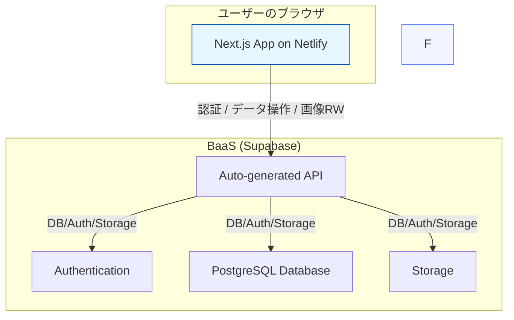
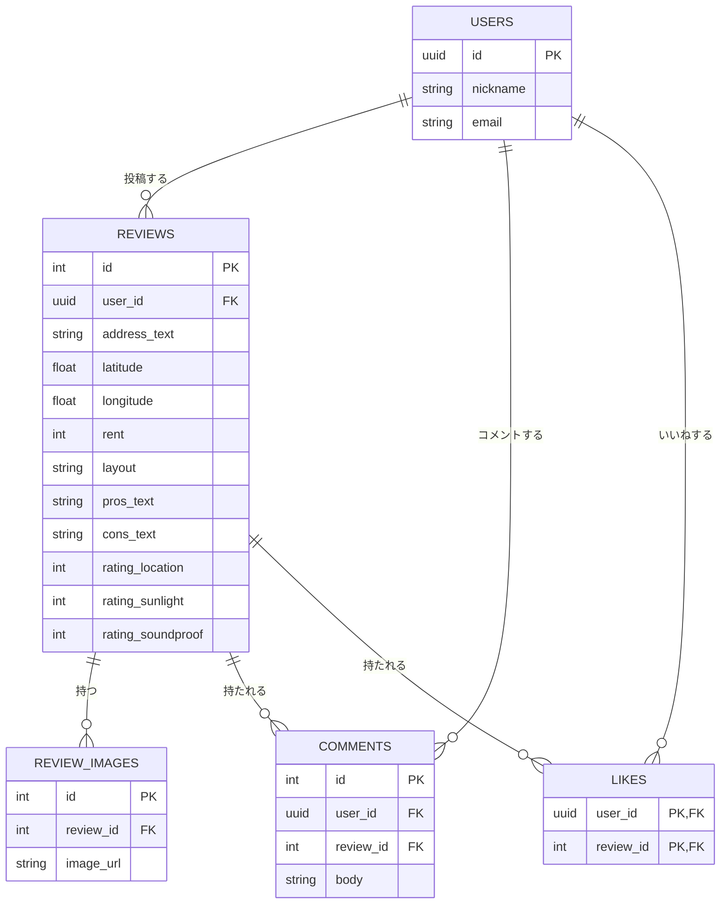

# アーキテクチャ設計書：住まい口コミ SNS (v5)

## 1. 概要

本アプリケーションは、BaaS (Backend as a Service) を活用した Jamstack 構成を採用する。
フロントエンドは`Next.js` (React/TypeScript)で構築する。レビュー投稿プロセスには**地図からの住所選択機能**が追加され、ユーザー体験の向上を図る。
バックエンド機能（データベース、認証、API、ストレージ）はすべて`Supabase`に集約し、サーバー管理不要の構成を実現する。フロントエンドは`Netlify`にデプロイする。

## 2. 全体構成図

## 3. フロントエンド

| 要素               | 技術選定       | 備考                              |
| ------------------ | -------------- | --------------------------------- |
| フレームワーク     | Next.js        | App Routerを採用                 |
| 言語               | TypeScript     | 型安全な開発を実現                |
| UI ライブラリ      | React          | v18以降を採用                     |
| スタイリング       | Tailwind CSS   | Spotify風ダークテーマをカスタム実装 |
| 国際化 (i18n)      | next-intl      | 軽量な国際化ソリューション        |
| 地図機能           | Mapbox GL JS, Mapbox Geocoding API | レビュー投稿時の住所検索・位置選択、住所の自動入力に使用。APIキーの安全な管理が必要。 |
| デプロイ先         | Netlify        | ISR対応あり                      |

## 4. バックエンド (BaaS)

| 要素             | 技術選定                           |
| ---------------- | ---------------------------------- |
| プラットフォーム | Supabase                           |
| データベース     | PostgreSQL (Supabase)              |
| API              | Auto-generated REST API (Supabase) |
| 認証             | Auth (Supabase)                    |
| ストレージ       | Storage (Supabase)                 |

自前のバックエンドサーバー（NestJS 等）は不要となり、すべての機能を Supabase が提供します。

## 5. ER 図 (データベース設計)

ER 図はデータ構造を示すため、バックエンドの技術変更による影響はありません。このスキーマを Supabase 上で構築します。

**注意事項：**
Supabase Auth の users テーブルと連携するため、USERS テーブルの id は uuid 型を想定しています。
