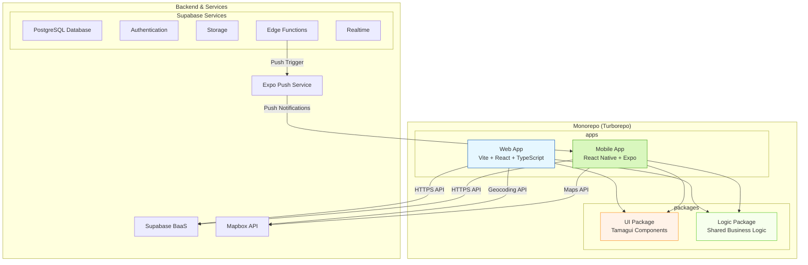
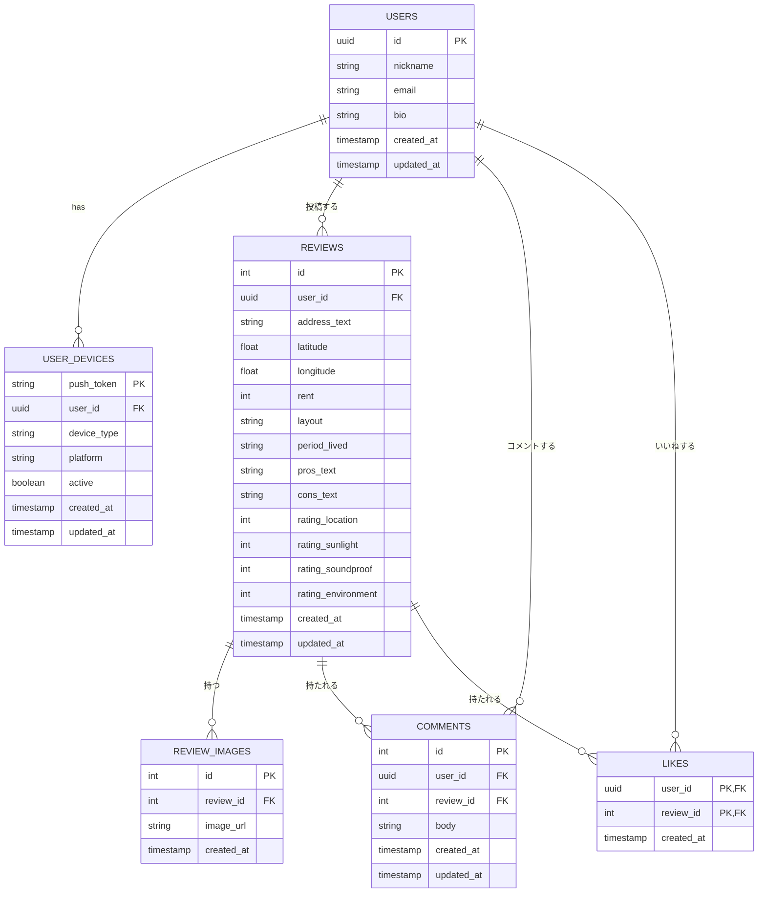
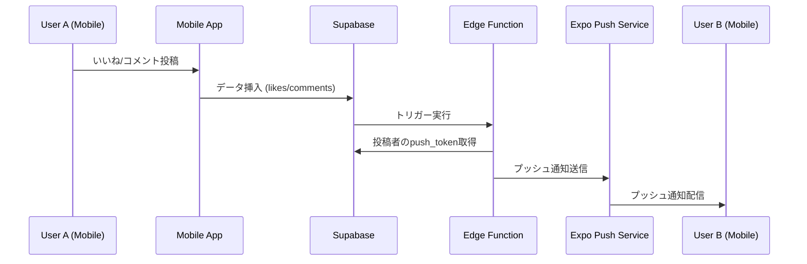

# アーキテクチャ設計書：住まい口コミ SNS (v7 - モノレポ版)

## 1. 概要

本プロジェクトは、Web・iOS・Androidの3プラットフォームに対応するアプリケーションを、単一のリポジトリで効率的に管理・開発する「モノレポ」構成を採用する。
モノレポ内は、アプリケーション層（Web: Vite + React, Mobile: React Native + Expo）と、両者で共有されるライブラリ層（共通UI: Tamagui, 共通ロジック: TypeScript）に分割される。
これにより、コードの再利用性を最大化し、開発工数とメンテナンスコストを削減する。

## 2. 全体構成図



## 3. プロジェクト構成 (モノレポ)

モノレポの管理には `Turborepo` を採用し、効率的なタスク実行とビルドキャッシュを実現する。

### 3.1 ディレクトリ構造

```
yadori-monorepo/
├── apps/
│   ├── web/                    # Webアプリケーション
│   │   ├── src/
│   │   │   ├── components/     # Web専用コンポーネント
│   │   │   ├── pages/          # ページコンポーネント
│   │   │   ├── contexts/       # React Context
│   │   │   └── main.tsx        # エントリーポイント
│   │   ├── public/             # 静的ファイル
│   │   ├── index.html          # HTMLテンプレート
│   │   ├── vite.config.ts      # Vite設定
│   │   └── package.json        # Web依存関係
│   └── mobile/                 # モバイルアプリケーション
│       ├── app/                # Expo Router構成
│       │   ├── (tabs)/         # タブナビゲーション
│       │   └── _layout.tsx     # ルートレイアウト
│       ├── assets/             # アプリアイコン等
│       ├── app.json            # Expo設定
│       ├── metro.config.js     # Metro設定
│       └── package.json        # Mobile依存関係
├── packages/
│   ├── ui/                     # 共有UIライブラリ
│   │   ├── src/
│   │   │   ├── components/     # Tamaguiコンポーネント
│   │   │   ├── theme.ts        # テーマ定義
│   │   │   └── tamagui.config.ts # Tamagui設定
│   │   └── package.json        # UI依存関係
│   └── logic/                  # 共有ビジネスロジック
│       ├── src/
│       │   ├── api.ts          # API関数
│       │   ├── auth.ts         # 認証ロジック
│       │   ├── supabase.ts     # Supabaseクライアント
│       │   ├── types.ts        # 型定義
│       │   ├── utils/          # ユーティリティ関数
│       │   └── i18n.ts         # 国際化設定
│       └── package.json        # Logic依存関係
├── supabase/
│   └── migrations/             # データベースマイグレーション
├── package.json                # ルートパッケージ設定
├── turbo.json                  # Turborepo設定
└── tsconfig.json               # TypeScript設定
```

### 3.2 パッケージ詳細

| パス | 説明 | 主要技術 |
|---|---|---|
| `apps/web` | **Webアプリケーション:** 既存のWebサイト。`packages/*` を参照する。 | Vite, React, TypeScript, Tailwind CSS |
| `apps/mobile` | **モバイルアプリ:** iOS/Androidアプリ。`packages/*` を参照する。Expoの利用により、ビルドやプッシュ通知の実装を簡略化する。 | React Native, Expo, TypeScript |
| `packages/ui` | **共有UIライブラリ:** Webとモバイルの両方でネイティブに動作するUIコンポーネント群。ボタン、フォーム、カードなどをここに定義する。 | Tamagui, React |
| `packages/logic` | **共有ビジネスロジック:** Supabaseクライアントのインスタンス、API通信関数、状態管理ストア、型定義など、プラットフォームに依存しないロジックをここに集約する。 | TypeScript, Supabase JS |

## 4. フロントエンド技術スタック

### 4.1 Web アプリケーション (apps/web)

| 要素 | 技術選定 | 備考 |
|---|---|---|
| **フレームワーク** | Vite + React | 高速な開発環境とビルド |
| **言語** | TypeScript | 型安全な開発を実現 |
| **UI ライブラリ** | React 18 | v18以降を採用 |
| **スタイリング** | Tailwind CSS + Tamagui | Spotify風ダークテーマをカスタム実装 |
| **ルーティング** | React Router DOM | SPA用ルーティング |
| **国際化** | react-i18next | 軽量な国際化ソリューション |
| **地図機能** | Mapbox GL JS | レビュー投稿時の住所検索・位置選択 |
| **アイコン** | Lucide React | 軽量なアイコンライブラリ |

### 4.2 モバイル アプリケーション (apps/mobile)

| 要素 | 技術選定 | 備考 |
|---|---|---|
| **フレームワーク** | React Native + Expo | クロスプラットフォーム開発 |
| **言語** | TypeScript | 型安全な開発を実現 |
| **UI ライブラリ** | React Native + Tamagui | ネイティブコンポーネント |
| **ルーティング** | Expo Router | ファイルベースルーティング |
| **地図機能** | react-native-maps + Mapbox | ネイティブ地図表示 |
| **プッシュ通知** | Expo Notifications | プッシュ通知機能 |
| **アイコン** | Expo Vector Icons | React Native用アイコン |

### 4.3 共有ライブラリ

#### packages/ui (Tamagui)
- **目的**: Web・Mobile両対応のUIコンポーネント
- **主要コンポーネント**: Button, Card, Input, Text, Theme
- **特徴**: プラットフォーム固有の最適化を自動実行

#### packages/logic
- **目的**: ビジネスロジックの共有
- **主要モジュール**: 
  - Supabaseクライアント
  - API通信関数
  - 認証ロジック
  - 型定義
  - ユーティリティ関数
  - 国際化設定

## 5. バックエンド & 外部サービス

| 要素 | 技術選定 | 役割 |
|---|---|---|
| **BaaS** | **Supabase** | データベース、認証、ストレージ、サーバーレス関数を提供 |
| └ **Database** | PostgreSQL | メインデータストレージ |
| └ **Auth** | Supabase Auth | ユーザー認証・セッション管理 |
| └ **Storage** | Supabase Storage | 画像ファイルストレージ |
| └ **Functions** | Supabase Edge Functions | **プッシュ通知のトリガー実行** |
| └ **Realtime** | Supabase Realtime | リアルタイムデータ同期 |
| **地図** | Mapbox API | ジオコーディング、リバースジオコーディング機能 |
| **プッシュ通知** | Expo Push Notification Service | React Nativeアプリへのプッシュ通知配信 |

## 6. データベース設計 (ER図) の更新

プッシュ通知の宛先を管理するため、`user_devices` テーブルを新たに追加する。



### 6.1 新規テーブル: user_devices

```sql
CREATE TABLE user_devices (
  push_token text PRIMARY KEY,
  user_id uuid NOT NULL REFERENCES users(id) ON DELETE CASCADE,
  device_type text NOT NULL, -- 'ios', 'android'
  platform text NOT NULL,    -- 'mobile'
  active boolean DEFAULT true,
  created_at timestamptz DEFAULT now(),
  updated_at timestamptz DEFAULT now()
);
```

## 7. プッシュ通知アーキテクチャ



### 7.1 プッシュ通知フロー

1. **トークン登録**: アプリ起動時にExpoからプッシュトークンを取得し、`user_devices`テーブルに保存
2. **イベント検知**: `likes`または`comments`テーブルへの新規挿入をSupabase Functionがトリガー検知
3. **通知送信**: Edge Function内で投稿者のプッシュトークンを取得し、Expo Push Serviceに通知リクエスト送信
4. **配信**: Expo Push ServiceがiOS/Androidの各プッシュサービス経由で通知配信

## 8. 開発・ビルドフロー

### 8.1 Turborepo タスク定義

```json
{
  "pipeline": {
    "build": {
      "dependsOn": ["^build"],
      "outputs": [".next/**", "!.next/cache/**", "dist/**"]
    },
    "dev": {
      "cache": false,
      "persistent": true
    },
    "lint": {
      "dependsOn": ["^lint"]
    },
    "type-check": {
      "dependsOn": ["^type-check"]
    }
  }
}
```

### 8.2 開発コマンド

```bash
# 全体の開発サーバー起動
npm run dev

# 個別アプリの開発
npm run dev --filter=@yadori/web
npm run dev --filter=@yadori/mobile

# 全体のビルド
npm run build

# 型チェック
npm run type-check

# リント
npm run lint
```

## 9. デプロイメント戦略

### 9.1 Web アプリケーション
- **プラットフォーム**: Netlify
- **ビルド設定**: `apps/web`ディレクトリをルートとして設定
- **環境変数**: Supabase, Mapbox APIキーの設定

### 9.2 モバイル アプリケーション
- **ビルドサービス**: Expo Application Services (EAS)
- **配信**: App Store, Google Play Store
- **プッシュ通知**: Expo Push Notification Service

### 9.3 CI/CD パイプライン
- **プラットフォーム**: GitHub Actions
- **フロー**:
  1. コード変更検知
  2. 依存関係インストール
  3. 型チェック・リント実行
  4. ビルド実行
  5. テスト実行
  6. デプロイ (Web: Netlify, Mobile: EAS)

## 10. セキュリティ考慮事項

### 10.1 APIキー管理
- Mapbox APIキーは環境変数で管理
- フロントエンド用の制限付きAPIキーを使用
- 本番環境では適切なリファラー制限を設定

### 10.2 プッシュ通知セキュリティ
- プッシュトークンの暗号化保存
- 不正なトークンの定期的なクリーンアップ
- 通知内容の個人情報保護

### 10.3 位置情報プライバシー
- 正確な住所ではなく、最寄り駅からの距離表記を推奨
- ユーザーが詳細な住所を入力した場合の注意喚起
- 位置情報の精度調整オプション提供

## 11. パフォーマンス最適化

### 11.1 モノレポ最適化
- Turborepoのキャッシュ機能活用
- 共有ライブラリの効率的なビルド
- 不要な依存関係の削除

### 11.2 Web アプリケーション
- Viteの高速ビルド活用
- コード分割とレイジーローディング
- 画像最適化とCDN活用

### 11.3 モバイル アプリケーション
- React Native最適化
- バンドルサイズの最小化
- ネイティブモジュールの効率的な使用

## 12. 今後の拡張計画

### 12.1 短期的な拡張
- プッシュ通知機能の完全実装
- モバイルアプリの機能完成
- パフォーマンス最適化

### 12.2 中期的な拡張
- オフライン対応
- PWA対応
- 高度な検索機能

### 12.3 長期的な拡張
- AI による住まい推薦機能
- VR/AR による物件内覧機能
- ブロックチェーン技術の活用