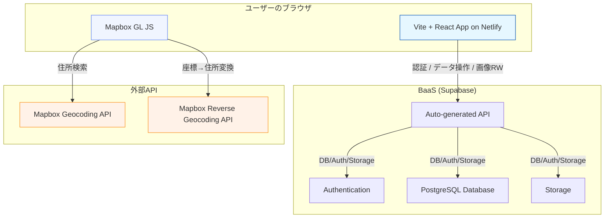
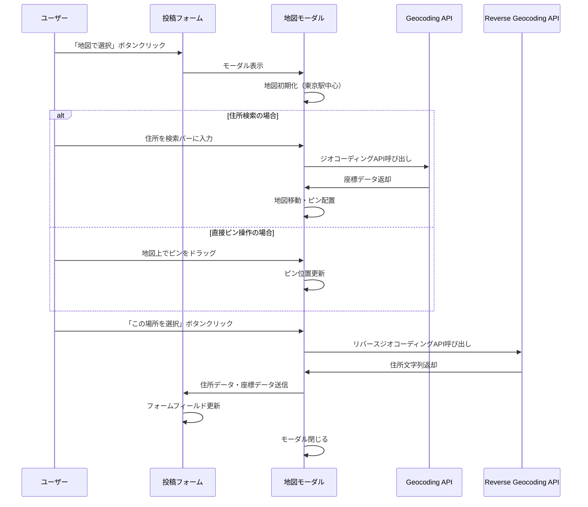
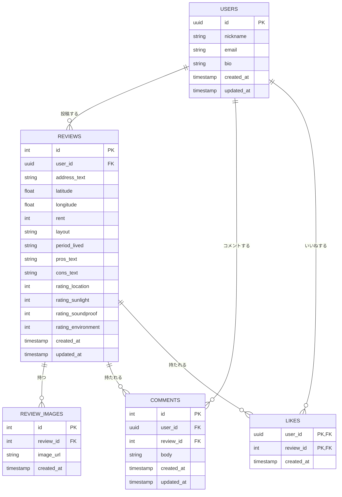

# アーキテクチャ設計書：住まい口コミ SNS (v5)

## 1. 概要

本アプリケーションは、BaaS (Backend as a Service) を活用した Jamstack 構成を採用する。
フロントエンドは`Vite + React + TypeScript`で構築する。レビュー投稿プロセスには**地図からの住所選択機能**が追加され、ユーザー体験の向上を図る。
バックエンド機能（データベース、認証、API、ストレージ）はすべて`Supabase`に集約し、サーバー管理不要の構成を実現する。フロントエンドは`Netlify`にデプロイする。

## 2. 全体構成図



## 3. フロントエンド

| 要素               | 技術選定       | 備考                              |
| ------------------ | -------------- | --------------------------------- |
| フレームワーク     | Vite + React   | 高速な開発環境                    |
| 言語               | TypeScript     | 型安全な開発を実現                |
| UI ライブラリ      | React          | v18以降を採用                     |
| スタイリング       | Tailwind CSS   | Spotify風ダークテーマをカスタム実装 |
| 国際化 (i18n)      | react-i18next  | 軽量な国際化ソリューション        |
| 地図機能           | Mapbox GL JS, Mapbox Geocoding API | レビュー投稿時の住所検索・位置選択、住所の自動入力に使用。APIキーの安全な管理が必要。 |
| デプロイ先         | Netlify        | 静的サイトホスティング            |

## 4. バックエンド (BaaS)

| 要素             | 技術選定                           |
| ---------------- | ---------------------------------- |
| プラットフォーム | Supabase                           |
| データベース     | PostgreSQL (Supabase)              |
| API              | Auto-generated REST API (Supabase) |
| 認証             | Auth (Supabase)                    |
| ストレージ       | Storage (Supabase)                 |

自前のバックエンドサーバー（NestJS 等）は不要となり、すべての機能を Supabase が提供します。

## 5. 地図機能の詳細設計

### 5.1 地図からの住所選択フロー



### 5.2 コンポーネント構成

```
src/components/map/
├── MapModal.tsx              # 地図選択モーダル
├── MapboxMap.tsx            # Mapbox地図コンポーネント
├── AddressSearchBar.tsx     # 住所検索バー
└── LocationPicker.tsx       # 位置選択ピン
```

## 6. ER 図 (データベース設計)

ER 図はデータ構造を示すため、バックエンドの技術変更による影響はありません。このスキーマを Supabase 上で構築します。



**注意事項：**
- Supabase Auth の users テーブルと連携するため、USERS テーブルの id は uuid 型を想定
- latitude, longitude フィールドで地図上の正確な位置情報を保存
- address_text は地図から自動取得された住所文字列を保存

## 7. セキュリティ考慮事項

### 7.1 APIキー管理
- Mapbox APIキーは環境変数で管理
- フロントエンド用の制限付きAPIキーを使用
- 本番環境では適切なリファラー制限を設定

### 7.2 位置情報プライバシー
- 正確な住所ではなく、最寄り駅からの距離表記を推奨
- ユーザーが詳細な住所を入力した場合の注意喚起
- 位置情報の精度調整オプション提供

## 8. パフォーマンス最適化

### 8.1 地図ライブラリ
- Mapbox GL JSの遅延読み込み
- 地図タイルのキャッシュ活用
- 不要な地図機能の無効化

### 8.2 API呼び出し最適化
- ジオコーディングAPIのレート制限対応
- 検索クエリのデバウンス処理
- エラーハンドリングとリトライ機能